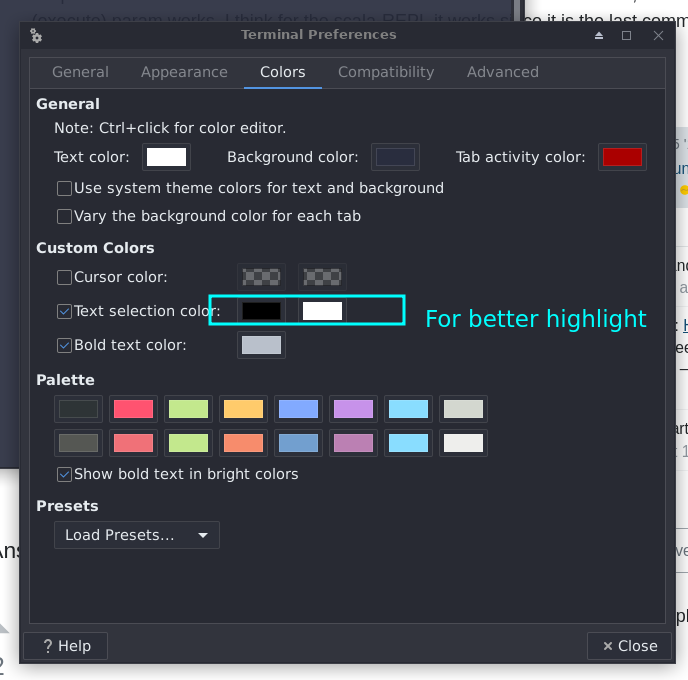

# Setting Up XFCE

## Vim, Terminal and Theme

- Install ocs-url
- System Appearance : `Qogir-dark`
- Icons : `Tela circle manjaro dark`
- Window Manager : `Qogir-dark`

- Install vim
- Install mdr : Markdown Library for *Privew Markdown* package from [https://github.com/MichaelMure/mdr](https://github.com/MichaelMure/mdr)
	- To do this download the mdr binary, rename it to mdr and move it to `/usr/local/bin` - path directory.
- Place vim rc as `~/.vimrc` 
- Do PluginInstall for Vundle
- Create workspace folder
- Place bash rc as `~/.bashrc`
- Place the `myxffce4theme.theme` in `/usr/share/xfce4/terminal/colorschemes/` - the default colorscheme folder for xfce4
- Now goto preferance and choose the theme in Color Tab.
	- Terminal options in image below
	- Keep the transparency to 0.92O
	- Font used is `Pragmata Medium` , size **14**

## Conky

- For conky setup
	- Install conky
	- Place conkyrc as `~/.conkyrc`
	- Place todo.conf in any directory and use todo.md to edit tasks
	- Run conky -d first
	- Then run conky -c path_to_todo.conf. For relative path use `./`

:warning: TODO : todo configs

## Keyboard Shortcuts

- Terminal :
    	- Create a folder workspace in home directory for work and a storage directory from storing
	- `xfce4-terminal --working-directory=/home/lagnos/workspace/` -> `Alt+T`

- Firefox Profiles :
	- Create three profiles work_w, work_e and android
	- `firefox -P work_w` -> `Ctrl + Alt + W`
	- `firefox -P work_e` -> `Ctrl + Alt + E`
	- - `firefox -P android` -> `Ctrl + Alt + a`

- Screenshot:
	- `flameshot gui` -> printscreen 
	- `flameshot gui` -> FN+(F6)??

- Folder:
	- `thunar` -> `Ctrl + Alt + F`
	- `thunar` -> `Windows + E`

## Firefox

- Keep default zoom level to 120%
- Import bookmarks

# Bash Aliases

- fucking = sudo
- Install okular for `pdf` bash bind
	- pdf = okular
- lh = ls -lah --color=auto
- mk = make
- mkc = make clean
- gc = git commit
